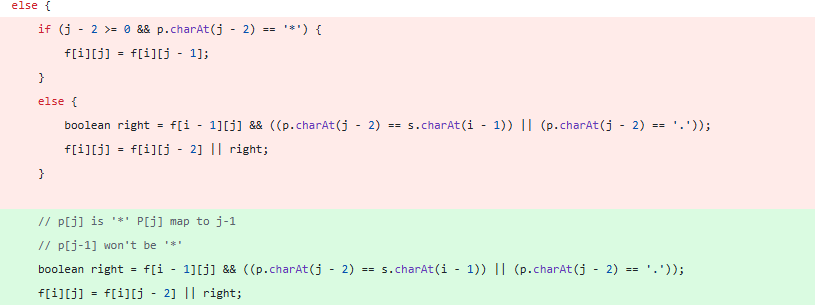
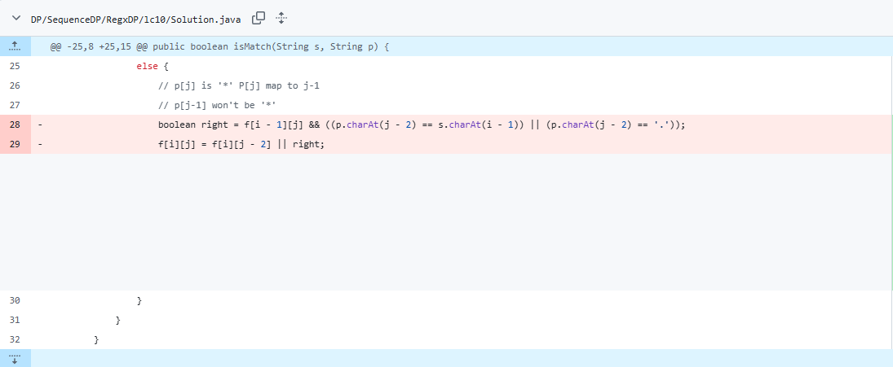
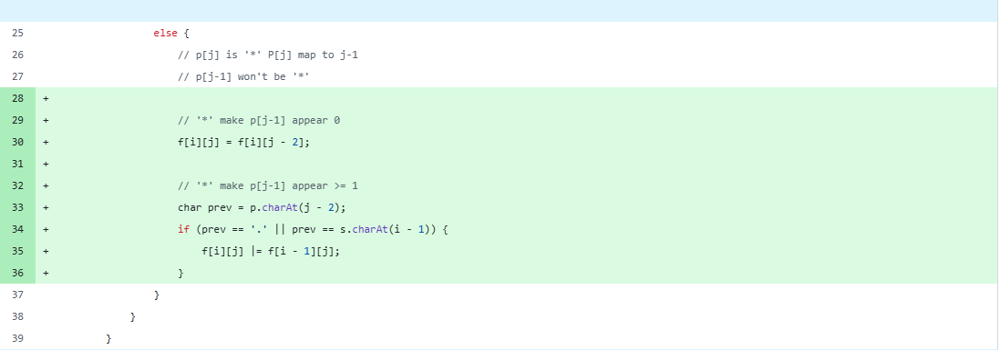
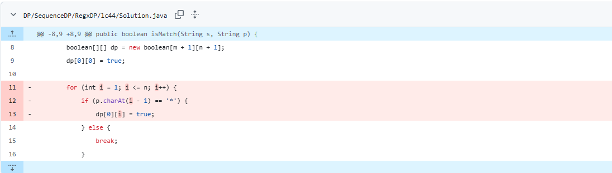
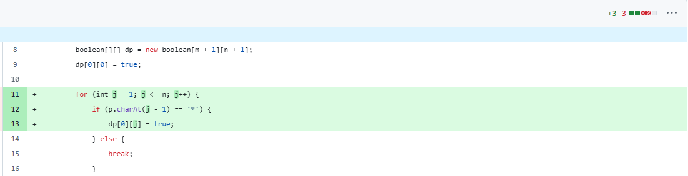

# 题目描述

给你一个字符串 s 和一个字符规律 p，请你来实现一个支持 '.' 和 '*' 的正则表达式匹配。

'.' 匹配任意单个字符
'*' 匹配零个或多个前面的那一个元素
所谓匹配，是要涵盖 整个 字符串 s 的，而不是部分字符串。

 
示例 1：

输入：s = "aa", p = "a"
输出：false
解释："a" 无法匹配 "aa" 整个字符串。
示例 2:

输入：s = "aa", p = "a*"
输出：true
解释：因为 '*' 代表可以匹配零个或多个前面的那一个元素, 在这里前面的元素就是 'a'。因此，字符串 "aa" 可被视为 'a' 重复了一次。
示例 3：

输入：s = "ab", p = ".*"
输出：true
解释：".*" 表示可匹配零个或多个（'*'）任意字符（'.'）。
 

提示：

1 <= s.length <= 20
1 <= p.length <= 20
s 只包含从 a-z 的小写字母。
p 只包含从 a-z 的小写字母，以及字符 . 和 *。
保证每次出现字符 * 时，前面都匹配到有效的字符

# 参考链接

https://leetcode.cn/problems/regular-expression-matching/solutions/763744/zheng-ze-biao-da-shi-pi-pei-dong-tai-gui-c4iv/

公式推导 refer 完全背包(TBD, add link from 完全背包)

部分Copy自link

# 思路
$S,P$的有效字符串下标从1开始
根据 $P[j]$ 为`.` 或者字母或者`*`，可以有两种情况

# 情况1
$P[j]$为`.`或字母，则 $f[i][j] \leftarrow f[i-1][j-1] \ and \ (P[j-1] == S[i] \ or \ P[j-1] == ''.'')$

# 情况2
$P[j]$为`*`, `*`代表可以匹配 $P[j-1]$ 0, 1, ..k次，记为 $m(0), m(1), ..., m(k)$

$f[i][j] \leftarrow m(0) \ or \ m(1) \ or \ ... \ or \ m(k)$

## 公式推导
### 匹配0次 m(0)
$P[j]$影响 $P[j-1]$ ,使得 $P[j-1]$ 匹配 $n==0$ 次

- $m(0) \leftarrow f[i][j-2]$

### 匹配1次 m(1)
$P[j]$影响 $P[j-1]$,使得 $P[j-1]$ 匹配 $n==1$ 次
- $P[j-1]==S[i]$
- $P[j-1]==''.''$

- $m(1) \leftarrow f[i-1][j-2] \ and \ (P[j-1] == S[i] \ or \ P[j-1] == ''.'')$

### 匹配2次 m(2)
$P[j]$影响 $P[j-1]$,使得 $P[j-1]$ 匹配 $n==2$ 次
- $P[j-1]==S[i] \ and \ S[i] == S[i-1]$
- $P[j-1]==''.'' \ and \ S[i]==S[i-1]$

- $m(2) \leftarrow f[i-2][j-2] \ and \ (P[j-1] == S[i] \ or \ P[j-1] == ''.'') \ and \ S[i] == S[i-1]$

### 匹配k次 m(k)
由此可以推得
$P[j]$影响 $P[j-1]$,使得 $P[j-1]$ 匹配 $n==k$ 次

- $m(k) \leftarrow f[i-k][j-2] \ and \ (P[j-1] == S[i] \ or \ P[j-1] == ''.'') \ and \ S[i] == S[i-1] \ and \ S[i]==S[i-2] .. \ and \ S[i] == S[i - (k-1)]$ 

## 优化公式

假设S,P长度均为N,k在极端情况下可以接近N,所以计算 $f[i][j]$ 的时间复杂度 接近 $O(N^3)$，可以进一步优化

记S中 $S[i]$ 和 $P[j-1]$ match为 $S_i$

- $m(1) \leftarrow f[i-1][j-2] \ and \ S_i$

记S中 $S[i-1]$ 和 $P[j-1]$ match为 $S_{i-1}$

- $m(2) \leftarrow f[i-2][j-2] \ and \ S_i \ and \ S_{i-1}$

记S中 $S[i-(k-1)]$ 和 $P[j-1]$ match为 $S_{i-(k-1)}$

- $m(k) \leftarrow f[i-k][j-2] \ and \ S_i \ and \ S_{i-1} ... \ and \ S_{i-(k-1)}$

由此

$f[i][j] \leftarrow f[i][j-2] \ \ or \ \ (f[i-1][j-2] \ and \ S_i) \ \ or \ \ (f[i-1][j-2] \ and \ S_i \ and \ S_{i-1}) \ \ or \ ...$

$f[i-1][j] \leftarrow f[i-1][j-2] \ \ or \ \ (f[i-2][j-2] \ and \ S_{i-1}) \ \ or \ \ (f[i-3][j-2] \ and \ S_{i-1} \ and \ S_{i-2}) \ \ or \ ...$

$f[i][j] \leftarrow f[i-1][j] \ and \ S_i$

$f[i][j] \leftarrow f[i-1][j] \ and \ (P[j-1] == S[i] \ or  P[j-1] == ''.'')$

此时，计算 $f[i][j]$ 的时间复杂度 优化为 $O(N^2)$

# 汇总
对于$S[i]$, $P[j]$ 为`.`或字母
- $f[i][j] \leftarrow f[i-1][j-1] \ and \ (P[j-1] == S[i] \ or \ P[j-1] == ''.'')$

$P[j]$为`*`
- $f[i][j] \leftarrow f[i-1][j] \ and \ (P[j-1] == S[i] \ or \ P[j-1] == ''.'')$

# 初始情况

$f[0][0]$ is true

$f[1][0], f[2][0], ... f[n][0]$ is false, 因为S只要有长度，P无法匹配

$f[0][n], n \ge 1$, S长度为0可以匹配

- "*" → **Note** 这种串是不合法的
- "***" → **Note** 这种串是不合法的
- ".\*" or "a\*"
- ".\*a\*" 

所以初始化规则
- 当 $p[j] == ''*''$ :
    - $f[0][j] = f[0][j-2]$
- 否则:
    - $f[0][j] = false$

# Hint
- 题目中的提示很重要，特别是**保证**

# ChatGPT Review建议

## p '**'不合法，所以remove 以下if

## 在P串中扫描到P[j]为'*'时
### Before

### After

## 变量统一，遍历p的时候用j，遍历s的时候用i
### Before

### After

## 滚动数组优化[TBD]

## TBD 还可以接着让AI给滚动数组的练习

