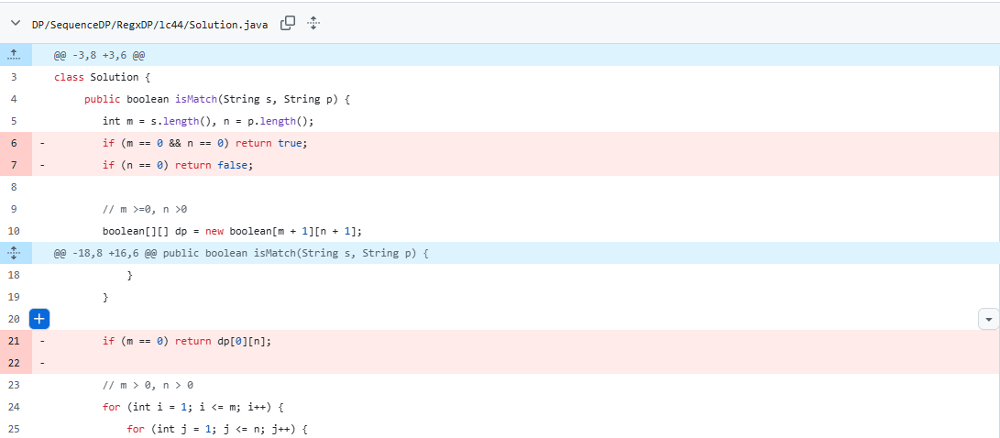
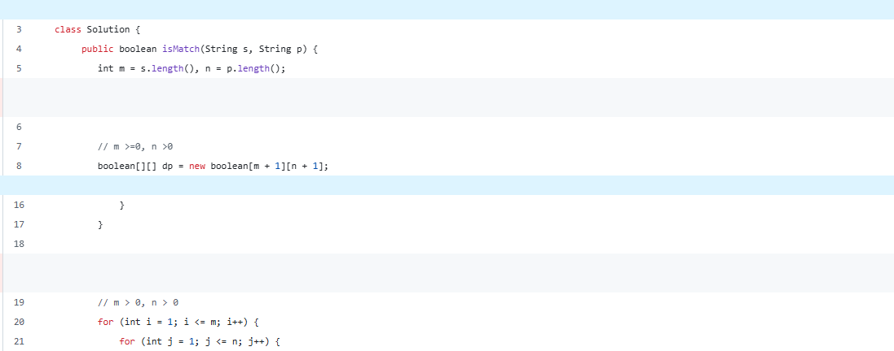

# 题目描述

给你一个输入字符串 (s) 和一个字符模式 (p) ，请你实现一个支持 '?' 和 '*' 匹配规则的通配符匹配：
'?' 可以匹配任何单个字符。
'*' 可以匹配任意字符序列（包括空字符序列）。
判定匹配成功的充要条件是：字符模式必须能够 完全匹配 输入字符串（而不是部分匹配）。

 
示例 1：

输入：s = "aa", p = "a"
输出：false
解释："a" 无法匹配 "aa" 整个字符串。
示例 2：

输入：s = "aa", p = "*"
输出：true
解释：'*' 可以匹配任意字符串。
示例 3：

输入：s = "cb", p = "?a"
输出：false
解释：'?' 可以匹配 'c', 但第二个 'a' 无法匹配 'b'。
 

提示：

0 <= s.length, p.length <= 2000
s 仅由小写英文字母组成
p 仅由小写英文字母、'?' 或 '*' 组成

# 思路
同leetcode 10

$S,P$的有效字符串下标从1开始
根据 $P[j]$ 为`?` 或者字母或者`*`，可以有两种情况

# 前序题
10

# 情况1
$P[j]$为`？`或字母，则 $f[i][j] \leftarrow f[i-1][j-1] \ and \ (P[j] == S[i] \ or \ P[j] == ''?'')$

# 情况2
$P[j]$为`*`, 此时`*`
- 不需要前面有`.`或者字母
- 可以匹配空串
- 可以匹配任意长度的任意字符

$f[i][j] \leftarrow m(0) \ or \ m(1) \ or \ ... \ or \ m(k)$

## 公式推导
### 匹配0次 m(0)
- $m(0) \leftarrow f[i][j-1]$

### 匹配1次 m(1)
- $m(1) \leftarrow f[i-1][j-1]$

### 匹配2次 m(2)
- $m(2) \leftarrow f[i-2][j-1]$

### 匹配k次 m(k)
- $m(k) \leftarrow f[i-k][j-1]$

$f[i][j] \leftarrow f[i][j-1] \ or \ f[i-1][j-1] \ or \ ... \ or \ f[i-k][j-1]$

## 优化
$f[i][j] \leftarrow f[i][j-1] \ or \ f[i-1][j-1] \ or \ ... \ or \ f[i-k][j-1]$

$f[i-1][j] \leftarrow f[i-1][j-1] \ or \ f[i-2][j-1] \ or \ ... \ or \ f[i-k][j-1]$

$f[i][j] \leftarrow f[i][j-1] \ or f[i-1][j]$

# 总结
$P[j]$为`？`或字母
- $f[i][j] \leftarrow f[i-1][j-1] \ and \ (P[j] == S[i] \ or \ P[j] == ''?'')$
  
$P[j]$为`*`
- $f[i][j] \leftarrow f[i][j-1] \ or f[i-1][j]$

# 初始条件

$f[0][0]$ is true

$f[1][0], f[2][0], ... f[n][0]$ is false, 因为S只要有长度，P无法匹配

$f[0][n], n \ge 1$, S长度为0可以匹配
- P: "\*" → true
- P: "\*\*" → true
- P: "\*\*\*" → true
- 换言之，但凡出现"?",后续 $f[0][j]$ 都为false

# ChatGPT Review建议
## 挪走对m,n的特判,因为dp能cover
### Before

### After

